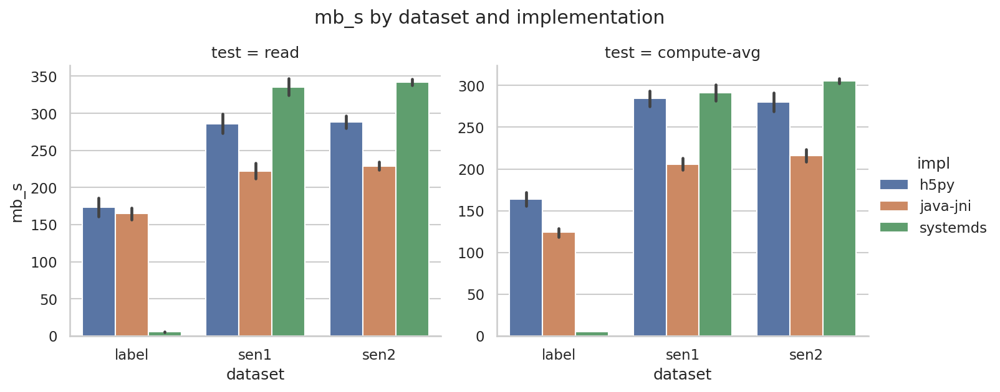
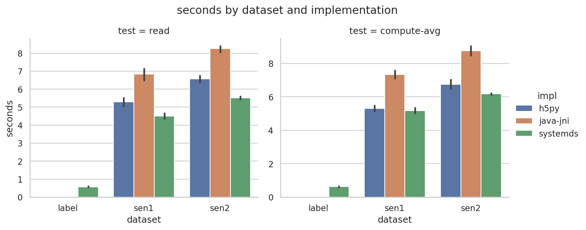

# HDF5 Reader Benchmark

This repo benchmarks HDF5 read performance across:

- SystemDS
- h5py
- Java (official JNI binding via `hdf5-java-jni`)

The benchmarks append results to a CSV in results/ .
All run and tested on a VM with Ubuntu 22.04, the disk.sh benchmark indicated about 300 MB/s uncached sequential read speed.

In the read test, the dml script [`benchmarks/dml/read.dml`](benchmarks/dml/read.dml) reads a dataset from an hdf5 and forces the dataset to be loaded into memory via the `dummy = nrow(X) + ncol(X)` statement.

In the compute-avg test, the dml script [`benchmarks/dml/compute_avg.dml`](benchmarks/dml/compute_avg.dml) reads a dataset from an hdf5 and computes the average of the dataset.

I have attempted to make the other two implementations do the same thing.

## Results

I used the validation hdf5 file from the So2Sat LCZ42 dataset which contains 3 datasets: `sen1`, `sen2`, and `label`.

Sytemds with read throughput with the proposed changes is 26% faster than  h5py and 32% faster than the  java binding for big datasets. [`results/plot_mb_s.png`](results/plot_mb_s.png):



The label dataset is super small, systemds is performing orders of magnitude slower than the other two.

Compute-avg results look the same.

Total seconds taken are visualized in [`results/plot_seconds.png`](results/plot_seconds.png):



## Data

- All datasets live under `data/` (not committed).
- Default file: `data/validation.h5`
- Example datasets inside: `sen1`, `sen2`, `label`


To get the data used in the tests , use:
```bash
just data-download
```

## Run with just (preferred)

```bash
just run-all-read sen1
just run-all-compute-avg sen1
```

Individual implementations:

```bash
just run-systemds-read sen1
just run-h5py-read sen1
just run-java-read sen1
```

## Run without just

```bash
benchmarks/run_all.sh read sen1 sen2 label
benchmarks/run_all.sh compute-avg sen1
```

Individual implementations:

```bash
benchmarks/run_systemds.sh read sen1
benchmarks/run_h5py.sh read sen1
benchmarks/run_java.sh read sen1
```

## Plotting

```bash
just plot
```

## Results CSV

All benchmarks append to `results/benchmarks.csv`:

```
timestamp,test,impl,file,dataset,seconds,mb_s,value
```

`value` is populated for compute-avg tests.

## Java JNI benchmark

The JNI-based benchmark is in `java-hdf5-jni/`.
To build it, you must set the HDF5_LIB_DIR environment variable to the directory where your libhdf5_java.so is located.
Unfortunately, there is no other way to do this.
Build it with:

```bash
cd java-hdf5-jni
bash build.sh
```

## SystemDS

SystemDS requires Java 17. Use these env vars if needed:

- `JAVA17_BIN` (path to Java 17 binary)
- `SYSTEMDS_DIR` (path to your SystemDS checkout)
